<p align="center">
  
</p>

<p align="center">
  <a href="LICENSE"></a>
  <a href="package.json"></a>
  <a href="packages/aws-lambda"></a>
  <a href="docs/SELF_HOSTING.md"></a>
  
  
</p>

<h1 align="center">The open-source incident engineer for serverless</h1>

<p align="center">
  BySentinel turns a raw Lambda failure into a ranked, explained incident with a
  suggested fix. It correlates the failure with the exact commit, <b>reads the
  code involved</b>, and can <b>reproduce the case locally in a sandbox</b>. All
  self-hosted, with secrets redacted before anything is stored or sent to a model.
</p>

<p align="center">
  <b>Error → commit SHA → clone the code → read it → AI explains it → reproduce it → ship the fix.</b>
</p>

---

BySentinel captures Lambda failures, runtime anomalies, security signals,
performance context and execution timelines, sanitizes sensitive data before it
leaves your function, analyzes the incident with the AI provider you choose, and
shows everything in a dedicated dashboard.

It is built for teams that want useful incident analysis without sending raw
production payloads to an opaque SaaS.

```ts
import { withBySentinel, BySentinel } from "@bywaretech/bysentinel-aws-lambda";

export const handler = withBySentinel(
  async (event) => {
    const rt = BySentinel.start();

    rt.step("Validate request");
    const body = event.body ? JSON.parse(event.body) : {};

    rt.step("Process payment");
    if ((body.amount ?? 0) > 10000) {
      throw new Error("payment provider rejected the charge");
    }

    rt.finish();
    return { statusCode: 200, body: JSON.stringify({ ok: true }) };
  },
  {
    project: "payments-api",
    environment: "production",
    collectorUrl: process.env.BYSENTINEL_COLLECTOR_URL,
    apiKey: process.env.BYSENTINEL_API_KEY,
    security: {
      sanitize: true,
      redactPII: true,
      redactSecrets: true,
      redactPaymentData: true,
      strictMode: true,
    },
  },
);
```

## The incident engineer

Most tools stop at "here is your stack trace". BySentinel goes further: when an
incident carries a commit SHA, it can pull the exact code that failed, feed it to
the analysis, and reproduce the failure in a local sandbox.

```txt
   Lambda error
        │
        ▼
   commit SHA ─────────────►  clone the repo at that exact commit
        │                          │
        │                          ▼
        │                     read the files in the stack trace
        │                          │
        ▼                          ▼
   sanitized event ──────►  AI analysis  ◄── real code as evidence
        │                          │
        │                          ▼
        │                     root cause + suggested fix + patch
        ▼                          │
   ministack sandbox  ◄────────────┘
        │
        ▼
   deploy the code, replay the request, attach the result + logs
```

The result reads like an engineer wrote it, for example:

> `createPix()` started returning `null` after `2.3.1`. The `/pix` endpoint began
> answering HTTP 429 and the retry was removed in commit `ab31f92`. It started 4
> minutes after the deploy. Recommended: restore the exponential retry.

Everything runs on your infrastructure. Git credentials and API keys stay on the
collector and are never returned to the browser.

## Screenshots

> Add PNGs under `docs/assets/` to render them here (overview, incident detail,
> AI settings). The dashboard is a dark, developer-tool UI built with Nuxt 4,
> Tailwind v4 and shadcn-vue.

<!--


-->

## Why BySentinel

- **Code-aware analysis**: clones the repository at the failing commit, reads the
  files in the stack trace, and gives the model real code as evidence.
- **Local reproduction**: replays the sanitized request against the code on a
  [ministack](https://github.com/ministackorg/ministack) sandbox and attaches the
  result and execution logs to the incident.
- **AI analysis without lock-in**: choose OpenAI, OpenRouter, Anthropic, DeepSeek,
  Ollama or a custom HTTP endpoint from the dashboard. Disabled? A safe heuristic
  analysis still runs.
- **Accounts and roles**: username/password login with `admin` and read-only
  `viewer` roles, seeded from a default account you set before install.
- **Security-first capture**: request bodies and headers are off by default, and
  strict mode can force them off even if someone enables them by mistake.
- **Secret and PII redaction**: redacts payment data, CPF/CNPJ-style IDs,
  emails, phones, tokens, private keys, cloud keys and high-entropy secrets, on
  the SDK and again on the collector.
- **Execution timeline**: instrument important steps and see where the failure
  happened and what became the bottleneck.
- **Release correlation**: commit, branch, version and repository are captured
  from your CI and linked straight to the incident.
- **Lambda-safe delivery**: collector failures are swallowed; your Lambda
  behavior is not changed by observability.
- **Self-hosted stack**: collector, dashboard, analyzer and sandbox run with
  Docker Compose on any VPS.
- **Signed webhooks**: outbound incident notifications are signed with
  HMAC-SHA256.

## Current Status

BySentinel is a self-hostable product you can run today.

| Area                                                                      | Status  |
| ------------------------------------------------------------------------- | ------- |
| `@bywaretech/bysentinel-aws-lambda` SDK                                              | Done    |
| `@bywaretech/bysentinel-node` SDK (Express, Fastify, workers)                        | Done    |
| Redaction, fingerprinting and security signals                            | Done    |
| AI prompt, schema validation and heuristic fallback                       | Done    |
| OpenAI, OpenRouter, Anthropic, DeepSeek, Ollama and custom HTTP providers | Done    |
| Collector API                                                             | Done    |
| Dedicated Nuxt 4 dashboard                                                | Done    |
| Accounts, roles and production boot guard                                 | Done    |
| Git code-context pipeline (clone at commit, read source)                  | Done    |
| ministack sandbox reproduction                                            | Done    |
| Docker Compose and Caddy production example                               | Done    |
| Dedicated worker and Postgres storage                                     | Planned |

## Architecture

```txt
AWS Lambda ── @bywaretech/bysentinel-aws-lambda ─┐
                                                 ├─► Collector API (/v1/events)
Node server ── @bywaretech/bysentinel-node ──────┘  │  redacts, groups by fingerprint
(Express/Fastify/worker)                            │  runs AI provider or heuristic
                                                    ▼
   Browser ──►  Dashboard (Nuxt)  ──proxy──►  Collector admin API
                                              │        │
                          clone repo at SHA ◄─┘        └─► signed webhook ──► your automation
                          reproduce on  ────────────►  ministack sandbox
```

Both SDKs can also fan the sanitized event straight to your own webhooks
(optionally authenticated and HMAC-signed) — see [Direct SDK webhooks](#direct-sdk-webhooks).

Three services ship in Docker Compose: **collector** (ingest, redaction, AI
orchestration, git/sandbox pipeline), **dashboard** (Nuxt UI + same-origin API
proxy) and **ministack** (local AWS-compatible sandbox, internal only). In
production, Caddy terminates TLS: it routes `/v1/*` and `/health` to the
collector and everything else to the dashboard, so the admin token never crosses
the public edge.

## Quick Start

### 1. Run the collector

```bash
git clone https://github.com/byware/bysentinel.git
cd bysentinel
cp .env.example .env
docker compose up -d --build
```

Open the dashboard and sign in with the default account:

```txt
http://localhost:4000

username: bysentinel
password: adminbysentinel
```

Change these before installing with `BYSENTINEL_DEFAULT_USER` /
`BYSENTINEL_DEFAULT_PASSWORD`, or create named accounts in **Settings → Users**
and remove the default one. You can also sign in with the collector admin token
directly.

The SDK ingest endpoint is:

```txt
http://localhost:4000/v1/events
```

### 2. Choose an AI provider

Log in to the dashboard and configure:

- provider: OpenAI, OpenRouter, Anthropic, DeepSeek, Ollama/local URL or custom HTTP
- model
- base URL, when needed
- API key
- timeout

The API key is stored server-side and is never returned to the browser. If AI is
disabled, BySentinel still generates a safe heuristic analysis.

Ollama is not bundled in Docker Compose. Run it wherever you prefer and paste a
reachable URL into the dashboard, for example:

```txt
http://host.docker.internal:11434
```

### 3. Install an SDK

Pick the SDK for your runtime — both share the same redaction, delivery, auth and
HMAC signing, and report to the same collector:

| Runtime | Package | Docs |
| ------- | ------- | ---- |
| AWS Lambda | `@bywaretech/bysentinel-aws-lambda` | [README](packages/aws-lambda/README.md) |
| Express, Fastify, workers, cron, plain functions | `@bywaretech/bysentinel-node` | [README](packages/node/README.md) |

```bash
# AWS Lambda
pnpm add @bywaretech/bysentinel-aws-lambda

# Node servers / workers
pnpm add @bywaretech/bysentinel-node
```

The Quick Start below uses the Lambda SDK; for the Node SDK jump to
[Node.js servers](#nodejs-servers-express-fastify-workers).

### 4. Configure your Lambda

```bash
BYSENTINEL_COLLECTOR_URL=http://your-collector.example.com
BYSENTINEL_API_KEY=bsk_your_project_key
BYSENTINEL_ENVIRONMENT=production
```

For local Docker, use:

```bash
BYSENTINEL_COLLECTOR_URL=http://localhost:4000
BYSENTINEL_API_KEY=bsk_local_dev_key
```

### 5. Wrap your handler

```ts
import { withBySentinel } from "@bywaretech/bysentinel-aws-lambda";

async function paymentHandler(event) {
  const body = event.body ? JSON.parse(event.body) : {};

  if (!body.amount) {
    throw new Error("missing payment amount");
  }

  return {
    statusCode: 200,
    body: JSON.stringify({ ok: true }),
  };
}

export const handler = withBySentinel(paymentHandler, {
  project: "payments-api",
  environment: process.env.BYSENTINEL_ENVIRONMENT ?? "production",
  collectorUrl: process.env.BYSENTINEL_COLLECTOR_URL,
  apiKey: process.env.BYSENTINEL_API_KEY,
});
```

When `paymentHandler` throws, BySentinel sends a sanitized incident to the
collector and re-throws the original error so Lambda behavior remains normal.

## SDK Usage

### Capture options

```ts
export const handler = withBySentinel(myHandler, {
  project: "orders-api",
  environment: "production",
  collectorUrl: process.env.BYSENTINEL_COLLECTOR_URL,
  apiKey: process.env.BYSENTINEL_API_KEY,

  capture: {
    query: true,
    requestBody: false,
    headers: false,
    stackTrace: true,
    performance: true,
  },

  security: {
    sanitize: true,
    redactPII: true,
    redactSecrets: true,
    redactPaymentData: true,
    strictMode: true,
  },

  delivery: {
    mode: "background",
    timeoutMs: 2000,
    retries: 0,
    maxEventBytes: 262144,
  },
});
```

`collectorUrl` is treated as a collector base URL and the SDK posts to
`/v1/events`. For exact webhook URLs such as webhook.site, set:

```ts
delivery: {
  endpointPath: "",
}
```

### Execution timeline

Use `BySentinel.start()` to record meaningful steps inside an invocation.

```ts
import { withBySentinel, BySentinel } from "@bywaretech/bysentinel-aws-lambda";

export const handler = withBySentinel(async (event) => {
  const rt = BySentinel.start();

  rt.step("Parse input");
  const input = JSON.parse(event.body ?? "{}");

  rt.step("Call payment provider").annotate({ provider: "stripe" });
  const charge = await createCharge(input);

  rt.step("Persist result");
  await saveCharge(charge);

  rt.finish();
  return { statusCode: 200, body: JSON.stringify(charge) };
}, options);
```

If the function fails, the active step is marked as failed and the slowest step
is highlighted as the bottleneck.

### Manual capture

Manual capture is useful for handled errors, warnings and business context.

```ts
import { captureException, captureMessage } from "@bywaretech/bysentinel-aws-lambda";

try {
  await chargeCustomer();
} catch (error) {
  await captureException(error, {
    feature: "checkout",
    step: "charge-customer",
  });
  throw error;
}

await captureMessage("Payment provider is slow", {
  severity: "warning",
  provider: "payments",
});
```

If you manually capture an exception and then re-throw it, the wrapper avoids
creating a duplicate incident.

### Direct SDK webhooks

The main production flow is SDK -> BySentinel collector -> dashboard -> signed
collector webhooks. If you also want the initial sanitized event sent directly
from the Lambda, add `delivery.webhooks`. Each entry can be a plain URL string
or an object with per-webhook authentication and extra headers, and you can
configure as many targets as you need:

```ts
export const handler = withBySentinel(myHandler, {
  project: "payments-api",
  environment: "production",
  collectorUrl: process.env.BYSENTINEL_COLLECTOR_URL,
  apiKey: process.env.BYSENTINEL_API_KEY,
  delivery: {
    timeoutMs: 5000,
    webhooks: [
      // 1. Plain URL (legacy form, still supported).
      "https://webhook.site/your-url",

      // 2. HTTP Basic auth.
      {
        url: "https://ops.example.com/hooks/bysentinel",
        auth: { type: "basic", username: "svc-bysentinel", password: process.env.HOOK_PASSWORD! },
      },

      // 3. Bearer token.
      {
        url: "https://api.pagerduty-proxy.example.com/ingest",
        auth: { type: "bearer", token: process.env.PAGERDUTY_TOKEN! },
      },

      // 4. API key in a header (defaults to `x-api-key`) plus a custom header.
      {
        url: "https://gateway.example.com/events",
        auth: { type: "apiKey", value: process.env.GATEWAY_KEY!, header: "X-Gateway-Key" },
        headers: { "x-tenant": "acme" },
      },
    ],
  },
});
```

Authentication modes:

| `auth.type` | Header sent                                    | Fields                          |
| ----------- | ---------------------------------------------- | ------------------------------- |
| `basic`     | `Authorization: Basic base64(user:pass)`       | `username`, `password`          |
| `bearer`    | `Authorization: Bearer <token>`                | `token`                         |
| `apiKey`    | `<header>: <value>` (default `x-api-key`)       | `value`, optional `header`      |

Add `sign: { secret }` to a webhook for **HMAC signing** — proving authenticity
and payload integrity, not just possession of a credential. A signed webhook
carries `x-bysentinel-timestamp`, `x-bysentinel-signature`
(`sha256=HMAC_SHA256(secret, "{timestamp}.{body}")`) and
`x-bysentinel-idempotency-key`, the same scheme as the collector's outbound
webhooks. `auth` and `sign` are independent — use either, both, or neither.

Every direct webhook also receives `content-type: application/json`,
`x-bysentinel-event-id`, and `x-bysentinel-delivery: sdk-webhook`. These reserved
headers, the auth header and the signature headers always win over any custom
`headers` you provide, so they cannot be accidentally overwritten. Webhooks are
delivered in parallel.

This is useful for teams that want BySentinel and an external receiver at the
same time, or for webhook-only testing before running the dashboard. You can
also set comma-separated URLs with `BYSENTINEL_DIRECT_WEBHOOK_URLS` (URL-only;
use the object form in code when a webhook needs authentication).

### Testing locally (no AWS)

`withBySentinel` wraps a plain `(event, context)` function, so you can run it
from any Node script — no AWS account and no deploy. Point `delivery.webhooks`
at a free [webhook.site](https://webhook.site) URL and watch the sanitized
incident arrive in your browser.

Save as `local-test.mjs` and run `node local-test.mjs`:

```js
import { withBySentinel } from "@bywaretech/bysentinel-aws-lambda";

// Your real handler. It throws here so we generate an incident to inspect.
function myHandler(event) {
  if (event.httpMethod !== "POST") {
    throw new Error(`Invalid HTTP method: ${event.httpMethod}`);
  }
  return { statusCode: 200, body: JSON.stringify({ message: "OK" }) };
}

const handler = withBySentinel(myHandler, {
  project: "payments-api",
  environment: "local",
  // No collector needed for a local test — deliver straight to a webhook.
  delivery: {
    timeoutMs: 5000,
    webhooks: ["https://webhook.site/your-unique-url"],
  },
  debug: true, // print internal diagnostics to the console
});

// Fake an API Gateway event + a Lambda context.
const event = {
  httpMethod: "GET", // change to "POST" to see a successful (silent) run
  path: "/test",
  queryStringParameters: { foo: "bar" },
};

const context = {
  awsRequestId: "local-test-1",
  functionName: "test-function",
  functionVersion: "$LATEST",
  memoryLimitInMB: "512",
  getRemainingTimeInMillis: () => 30_000, // enables timeout-risk detection
};

// The wrapped handler awaits delivery, so `await` here waits for the POST to
// finish before the process exits.
try {
  const result = await handler(event, context);
  console.log("handler ok:", result);
} catch (err) {
  console.error("handler threw (expected):", err.message);
}
```

What to expect:

- With `httpMethod: "GET"` the handler throws, so the SDK POSTs a **sanitized**
  event to your webhook.site URL and re-throws — you'll see
  `handler threw (expected)` and a request on webhook.site.
- Switch to `httpMethod: "POST"` and the handler returns `200` with **no** event
  delivered: healthy runs are silent unless a performance risk is detected.
- To test against a real collector instead, set `collectorUrl` + `apiKey` in
  place of (or alongside) `delivery.webhooks`.

### Node.js servers (Express, Fastify, workers)

Not on Lambda? Use `@bywaretech/bysentinel-node`. It shares the same redaction,
event assembly and delivery (auth + HMAC signing) as the Lambda SDK.

```bash
pnpm add @bywaretech/bysentinel-node
```

```ts
import express from "express";
import { bySentinelExpress, withBySentinel } from "@bywaretech/bysentinel-node";

const app = express();
app.use(express.json());

const bysentinel = bySentinelExpress({
  project: "payments-api",
  environment: "production",
  service: "express",
  collectorUrl: process.env.BYSENTINEL_COLLECTOR_URL,
  apiKey: process.env.BYSENTINEL_API_KEY,
});

app.use(bysentinel.scope); // early — manual captures inherit request context
app.post("/pay", async (req, res) => res.json(await createCharge(req.body)));
app.use(bysentinel.errorHandler); // last — captures unhandled errors

// Or wrap any async function (workers, cron, queue consumers):
const processJob = withBySentinel(async (job) => handle(job), {
  project: "billing",
  environment: "production",
  service: "worker",
});
```

Node events carry `runtime.provider: "node"` and no `lambda` context. Same
`delivery.webhooks` (auth + `sign`) as above. Full docs live in the
[package README](packages/node/README.md).

### Git and release correlation

BySentinel can attach release metadata to every event:

```bash
BYSENTINEL_GIT_SHA=abc1234
BYSENTINEL_GIT_BRANCH=main
BYSENTINEL_VERSION=1.4.0
BYSENTINEL_RELEASE=release-2026-07-06
BYSENTINEL_BUILD_TIME=2026-07-06T12:00:00Z
```

The SDK also detects common CI variables from GitHub Actions, GitLab CI and
Vercel.

## Self-hosting

Local:

```bash
docker compose up -d --build
```

Production-style VPS with Caddy and HTTPS:

```bash
BYSENTINEL_DOMAIN=runtime.example.com \
BYSENTINEL_API_KEYS=$(openssl rand -hex 32) \
BYSENTINEL_ADMIN_TOKEN=$(openssl rand -hex 32) \
BYSENTINEL_DEFAULT_PASSWORD=$(openssl rand -base64 32) \
BYSENTINEL_WEBHOOK_SECRET=$(openssl rand -hex 32) \
docker compose -f docker-compose.prod.yml up -d --build
```

See [docs/SELF_HOSTING.md](docs/SELF_HOSTING.md) for details.
See [docs/AI_PROVIDERS.md](docs/AI_PROVIDERS.md) for provider-specific setup.

DeepSeek uses an OpenAI-compatible API. In the dashboard, select `DeepSeek`
and leave Base URL empty, or use `https://api.deepseek.com` if you need to
override it. Do not use Custom HTTP for DeepSeek.

## Dashboard API

| Endpoint                           | Description                                     |
| ---------------------------------- | ----------------------------------------------- |
| `GET /health`                      | Health check                                    |
| `POST /v1/events`                  | SDK ingest endpoint, requires `x-api-key`       |
| `POST /api/auth/login`             | Username/password login (rate limited)          |
| `GET /api/incidents`               | List incidents                                  |
| `GET /api/incidents/:id`           | Get one incident                                |
| `POST /api/incidents/:id/analyze`  | Re-run AI analysis (admin)                       |
| `POST /api/incidents/:id/context`  | Clone at commit and attach source code (admin)  |
| `POST /api/incidents/:id/simulate` | Reproduce in the ministack sandbox (admin)      |
| `GET/POST /api/users`              | List / create accounts (admin)                  |
| `DELETE /api/users/:id`            | Remove an account (admin, never the last admin) |
| `GET/POST /api/settings/ai`        | AI provider config, never returns the API key   |
| `GET/POST /api/settings/git`       | Per-project repositories, secrets stay server-side |
| `GET/POST /api/settings/sandbox`   | ministack sandbox configuration                 |

The collector admin API accepts Basic or Bearer auth with `BYSENTINEL_ADMIN_TOKEN`.
The dashboard signs users in against the collector and proxies the admin API
server-side, so the token and passwords never reach the browser.

## Webhooks

Configure one or more webhook URLs:

```bash
BYSENTINEL_WEBHOOK_URLS=https://example.com/bysentinel
BYSENTINEL_WEBHOOK_SECRET=bswhsec_your_secret
```

BySentinel sends:

```txt
x-bysentinel-event: incident.analyzed
x-bysentinel-timestamp: <unix-ms>
x-bysentinel-signature: sha256=<hmac>
x-bysentinel-idempotency-key: <incident-id>:<analysis-time>
```

Signature payload:

```txt
HMAC_SHA256(secret, timestamp + "." + raw_body)
```

## Security Model

BySentinel is designed so sensitive data is reduced before network delivery and
before AI analysis, and so a fresh install cannot ship with weak defaults.

- The SDK redacts before sending; the collector redacts again before storage and AI.
- Unsanitized events are rejected. API keys protect ingest.
- **Production boot guard**: with `NODE_ENV=production` the collector refuses to
  start while the admin token, ingest key or seeded password are still the
  development defaults.
- **Accounts and roles**: passwords are hashed with scrypt; login is rate limited
  and constant-time (no username enumeration); the last admin cannot be deleted;
  `viewer` accounts are read-only.
- The dashboard talks to the collector through a same-origin Nitro proxy; the
  admin token and passwords live in httpOnly cookies and never reach the browser.
- The dashboard sends a strict CSP plus `X-Frame-Options`, `nosniff`,
  `Referrer-Policy` and `Permissions-Policy` on every response.
- Git credentials (SSH key / HTTP token) stay on the collector and are never
  returned to clients; tokens are passed per fetch, never written to `.git/config`.
- Outbound webhooks are signed with HMAC-SHA256.
- The AI prompt treats incident data as untrusted evidence, not instructions.

See [docs/SECURITY.md](docs/SECURITY.md).
See [docs/ARCHITECTURE.md](docs/ARCHITECTURE.md) for the system design.

## Monorepo

```txt
bysentinel/
  apps/
    collector/             ingest API, redaction, AI, git + sandbox pipeline, users
    dashboard/             Nuxt 4 dashboard and same-origin API proxy
  packages/
    core/                  types, redaction, timeline, fingerprint, AI helpers,
                           and core/sdk (shared SDK runtime: delivery, signing, capture)
    aws-lambda/            Lambda SDK (thin adapter over core/sdk)
    node/                  Node SDK — Express, Fastify, workers (adapter over core/sdk)
    providers/             OpenAI, OpenRouter, Anthropic, DeepSeek, Ollama, custom HTTP
  examples/
    aws-lambda-node/       instrumented Lambda example
    localstack/            LocalStack / ministack demo
  docs/
    AI_PROVIDERS.md  ARCHITECTURE.md  ROADMAP.md
    SECURITY.md      SELF_HOSTING.md  SMOKE_TEST.md
```

## Development

Requirements:

- Node.js 24+
- pnpm 9+
- Docker, for self-hosting tests

```bash
pnpm install
pnpm typecheck
pnpm test
pnpm build
pnpm lint
```

Run the collector locally:

```bash
pnpm docker:up
```

Send a smoke incident:

```bash
BYSENTINEL_COLLECTOR_URL=http://localhost:4000 \
BYSENTINEL_API_KEY=bsk_local_dev_key \
pnpm smoke:collector
```

Run the full local smoke check:

```bash
pnpm smoke:e2e
```

See [docs/SMOKE_TEST.md](docs/SMOKE_TEST.md).

## Runtime Support

- Local builds, Docker images and CI target Node.js 24+.
- The AWS Lambda SDK supports Lambda Node.js 20+ runtimes.
- The Node SDK targets Node.js 18+ (uses global `fetch` and `AsyncLocalStorage`).

## Roadmap

- Dedicated worker with queue-based async analysis
- Postgres storage and formal multi-tenancy
- Historical baselines and trend intelligence
- Similar incident clustering
- Pull request suggestions from incident analysis
- Per-repository environment variables for the sandbox

See [docs/ROADMAP.md](docs/ROADMAP.md).

## Contributing

See [CONTRIBUTING.md](CONTRIBUTING.md), [CODE_OF_CONDUCT.md](CODE_OF_CONDUCT.md)
and [CHANGELOG.md](CHANGELOG.md).

## License

Apache-2.0. See [LICENSE](LICENSE).
